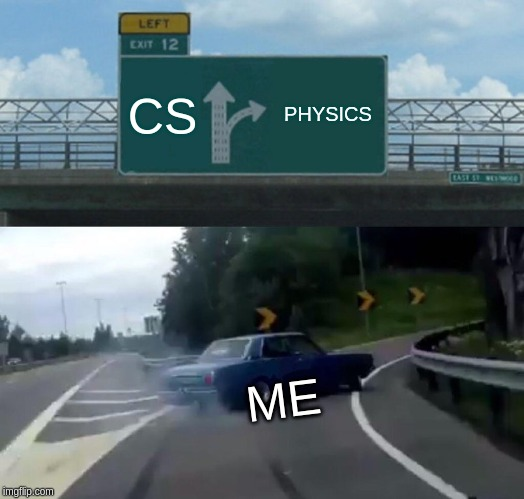

Hey yo, what’s up Good morning. Right now I am a freshman computer science student from Nepal and I wanna share my knowledge of how the day was.

I’ve just got onto campus from the bus station and head off to the Computer Science department. The first day was not about learning cool stuff like programming, hacking, and many more. The class was about to start at 12:00 pm and I was in traffic Jams. So I just go as fast as I can by walking on the street and went to the Campus. I was going to the Computer Science Department to take first-class but boom (thug-life) by Campus. There was no one else and I was only and I start to act a little bit weird what the hell is going on? One brother told me that hey bro, today is your computer science orientation and it is going to held in Physic Department.

After onwards, I went to the physic department and I meet new fellows. And It was awesome and having some meal too. We did some stupid things too like food was given to each and every one freshman student and we took two times. It was fun to do during orientation. We learned the syllabus and some tips told by Computer Science professors and other department professors too. And kind of knowledge of campus history and hostel too. After the end of the orientation of class instead of learning to hack and code, we just meet and make new friends. And time went so fast that we even didn’t notice and went to the hostel by walking and talking with friends. That’s how the day went in my first computer science class. If you wanna know more tips and something valuable stay connect and thank you.
