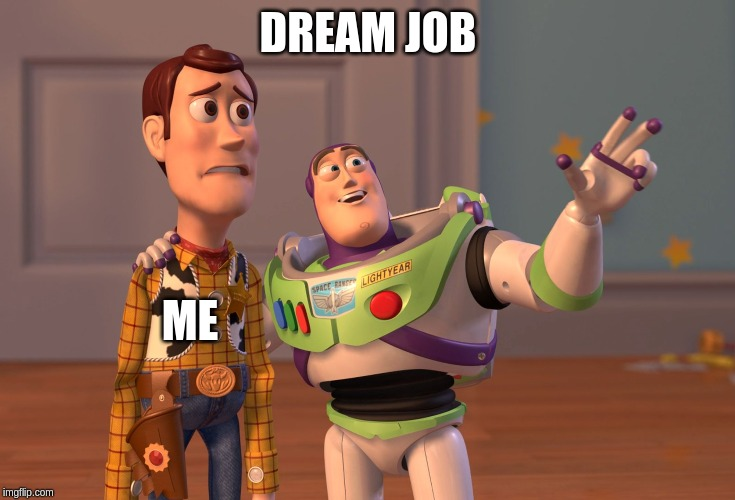
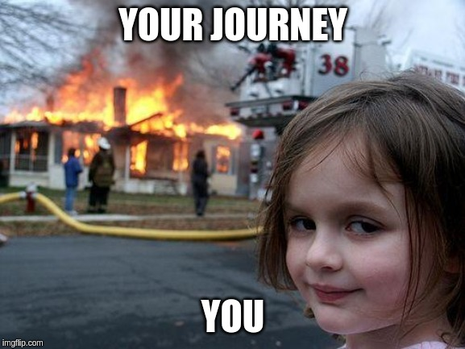

Hello Everyone, if you wanted to study computer science, make an awesome tech career in today’s world. Then you are in the right place. I am sorry for those people who are not from Nepal. This article is mostly focused on Nepali students, wanted to make a tech career through an academic degree.

Note: It doesn’t mean without degree, person can’t make tech career. Yes it’s possible through self taught. I have met a lots of awesome people without degree and having senior level positions at tech companies.

Some you of maybe confused, what the heck is CSIT or willing to pursue a bachelor’s degree after high school ?. Some might be saying, “I have never listened to this academic course before”.

CSIT is four years of Computer Science and Information Technology degree provided by Tribhuvan University. Right now, in this article, I am not going to talk about other computing degree or something else. CSIT is just a tech degree where its backbone lies in Computer science. The science behind computing technology like AI, virtual reality, and many more.

#### Features of CSIT !!!

- Latest and updated frequently course required for a tech career.
- International acceptance after csit
- Extensive career opportunities
- Focus on job oriented skills in the course
- More freedom to learn and upgrade your tech skills.

#### Jobs and career in CSIT

Well, you might be known that technology is still removing a lot of jobs in today’s world. In the same way, there comes a lot of jobs and other opportunities too. Let me give you an example, I am not a great fan of the pubg mobile game, but people play and earn income just by pushing towards gaming as a career. It has removed games that people played during the 19th century period.

This gives jobs and other opportunities to a gamer too. This cannot be done without technology. CSIT has a great scope in the present era and future too. But to catch up on the opportunities, you must have some requirements too like soft skills and hard skills. These are the jobs that you can have during a degree and after graduation.

- Cloud Engineer
- Full-stack Developer (mobile and web)
- AI developer
- Software Engineer and Developer
- Computer scientist
- Network Engineer
- Algorithmist
- IT officer (Both government and private) and Manager
- System Administrator
- Cyber Security Expert
- System Analyst and System engineer
- Data Scientist
- Technical writer and Blogger
- Database Administrator
- Lecturer

These jobs and opportunities are the best ones in the USA. Last thing if you are a tech student don’t seek a job, work hard but smartly so that you will make an opportunity and get hired.

#### Eligibility

CSIT is a scientific course so, you must go through high school from science faculty. Sorry for management and Arts, you cannot be enrolled. But instead of CSIT, you can still have tech skills and other computing degrees like BIT, BIM, and many more. You must have scored minimum grade C in both classes 11 and 12. For A levels, you must score grade D in general science.

> What are the documents need to enroll CSIT?

- SEE Mark sheet( class 10)
- SEE Certificate
- SEE Character Certificate
- Grade 11 Mark Sheet
- Grade 12 Mark Sheet
- High School(+2) Transcript from NEB
- Migration Certificate from NEB
- Provisional Certificate from NEB

> If the result of grade 12 is not published by the time, then just fill the form and go with documents up to #4 and add the documents from #5 to #8 after the result is out. But in the end, you must submit all the documents.

<b>Things that asked in CSIT entrance?</b>

Well, there is good news. The good news is the entrance preparation for this degree is optional (it’s not compulsory). If you are talented enough then, you can easily crack the csit entrance exam. If your academic career during high school is not so effective then, I recommend you go through the entrance preparation class. Still, I said, it’s all up to you whether you wanted to take the preparation class or not.

Talking about the syllabus of the entrance exam which is conducted by Tribhuwan University, right ?. Then, It includes 100 objective questions with four categories. Math, Physics, Chemistry, and English subjects are asked. Each question used to carry one mark. Each category has 25 questions. There is no negative marking in questions too. You may know about the IOE entrance exam, it’s not gonna be so many hard questions as a comparison with the IOE entrance exam.

#### Focus on key points and concepts.

To fill-up the form for CSIT, you can go any TU-affiliated colleges. It can be any private or government college which offers CSIT course. The actual fee to fill up the form is about Rs.1200. But private college may take extra charges too.

#### Enrolling in CSIT college?

The merit list is published on the basis of your marks which you scored on the entrance exam. And then used to select high scorers and open admission for them. This degree has the same whole process as IOE.

I still prefer you to fill up the form from government college unless you didn’t get time to do there to get on the merit list. To get enrolled in a government college, you must be on the merit list. If you take the form from a private college, it works on the admission process but there will be less chance to enroll in a government college.

#### Syllabus

After high school, you must look out the syllabus of that degree in which you are interested. CSIT contain minimal 126 credit hours, remember I said minimal you can still add more credit hours by studying more subject and giving exams. You will learn the fundamentals of Computer science within six semesters and the last semester is for filling industry gap skills. In the 7th semester, you must do a major project including 100 marks and in the 8th semester, you must do an internship in tech companies including 200 marks.

- Computer science fundamentals contain 75 credit hours.
- Natural science contains 6 credit hours.
- Mathematics contains 12 credit hours.
- English contains 3 credit hours.
- Social science and management contain 6 credit hours.
- Computer science and Information Technology contains 15 credit hours.
- Internship and Project contain 9 credit hours.

#### Status of CSIT and it’s graduates

In the past period, the management of CSIT was horrible and it’s still improving and doing better. Results will be published within 3 months after you gave that exam. Community is growing and supportive by seniors too. The status is good right now.

- More than 3000 csit graduates
- senior / junior software developers,engineers,designers.
- Fullstack developers(web/mobile)
- QA engineers
- Bank and ISP as a network engineer and system administrator
- Startup
- Researcher and Foreign university
- and many more.

#### Challenges

> Before enrolling in CSIT

- Late entrance exam than Engineering
- Students are unaware of the question patterns and lack of entrance preparation class except for the valley.
- Lack of scholarship schemes for able students and also for economically back-warded students.

> During Journey

- The unusual fee structure in a private college.
- Huge lack of teachers out of the valley.
- Lack of university and industry coordination unless you go through by yourself and only a few colleges solved this problem.
- Lack of mini-projects during the semester ends unless you do by yourself.
- There is a lack of motivation from university too for the student to build a tech career. Everything depends upon students more and the student must follow their responsibilities and their goals.
- Research opportunities are not much given to CS students which are must required skills to become a researcher for further time.
- The calendar system is not managed and well defined.

> Mini or pet project is a must for students in order to upgrade their knowledge and skills.

#### Conclusion

Well, finally if you are in Nepal and wanted to land a tech job with an academic degree, then I prefer you to take BSc CSIT. BSc CSIT is an awesome course. Yeah, there are many problems that need to solved related to the system of CSIT course but it is still solving those problems related to it. If you are curious about learning of technology then congratulation you should take the BSc CSIT course.

If this course doesn’t fit or interest you then, please I recommended you avoid studying this course. It’s gonna be hard if you seek to study for hoping to have a high income. That’s not the way, learn something that you are passionate about it. I hope you got an insightful message after reading this article.

I have shared my first day at my CS class. You can read from my post. Leave some Feedback .Thank you
