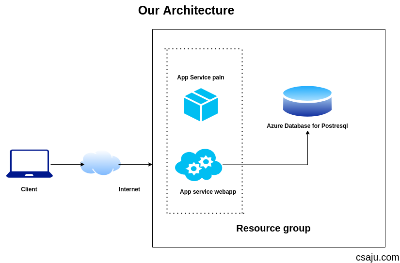

**Django** is a high-level Python Web framework that encourages rapid development and clean, pragmatic design. It’s known for its clean design and leaning towards rapid development cycles. **Microsoft Azure** is Microsoft’s cloud offering built for deploying and managing applications on its global network of data centers.

As I work with multi-cloud platform services with different technologies and tools, I’m going to walk through deploying a data-driven python Django web app to azure app service via **Azure CLI** which is pretty awesome and connect it to an azure PostgreSQL database.

> You can still use different methodologies to deploy your application.

Here is the architecture of our services which we will be demonstrate.

I’m not going to cover how to create or write a Django application, but instead, we’re going to focus on the last mile of development- getting it into production. But I will write about building a Simple API service in my upcoming blog articles. So stay updated.

#### Prerequisites

I’m assuming that you already have:

- Subscription to Azure
- Knowledge and experience with Python and Django
- Hands-on deploying web apps

> If you are a student and don’t have an Azure subscription, no problem you can have it through Azure for students.

Let’s get started. Well Let’s talk about Azure App services. It has tons of features for everything. You don’t have to make your VM (Virtual Machine) Server and configure with Nginx and do all those stuff. I am not saying that VM is bad, and Azure App service is cool.

Each and every service had its own pros and cons. You have to use those based on the requirements and conditions. I will be highlighting a few features of Azure App Services.

- Scalability
- Backup
- SSL
- Authentication and security
- Many more

If You haven’t install Azure CLI, I prefer you to go through docs. Let’s check the Azure CLI version on our machine.

```bash
az --version
```

Let's sign in to the Azure account through the Azure CLI

```bash
az login
```

These commands gonna pop up in the browser to gather your credentials. The command may take a few minutes to complete. We will do these following things in the Azure cloud service.

- Create a resource group and app service plan
- Create an app with the specified name and PostgreSQL database
- Zip deploy files from the current working directory to the app
- Load testing Django App using Locust
- Scale web app by Horizontal and Vertical one

Let’s create a resource group and app service plan.

```bash
az group create --name nameofresourcegroup --location westus2
```

Before creating the Postgres Database in Azure. Make sure you had already installed the db-up extension as we will go through using Azure CLI.

```bash
az extension add --name db-up
```

Alright let’s create the Postgres database in Azure with the az postgres up command:

```bash
az postgres up --resource-group nameofresourcegroup --location westus2 --sku-name B_Gen5_1 --server-name nameofDBserver --database-name nameofyourdb --admin-user uradminuser --admin-password urpassword --sl-enforcement Enabled
```

After taking a few minutes, you will get outputs as a JSON object that contains credentials. Here we used B_Gen5_1 (Basic, Gen5, 1 core )pricing tier which is the least expensive one. We have enabled access from your local IP Address and azure services. We have configured our resource-group with a nearby location with the Database server name, user, password, and enforced the SSL for security purposes.

Let’s create the app service app with our service plan.

```bash
az webapp up --resource-group nameofrsgroup --location westus2 --plan appserviceplan -sku B1 --name nameofweb
```

Basically what we have done is we just deployed our code to Azure app service with B1 (Basic pricing tier) that enables default logging and upload the repo using zip deployment with build automation enabled. We choose a particular resource group, a nearby location that makes your services efficient with the service plan, and our unique name of the web app.
<br>
I hope your web app is live. But there are certain things you have to maintain.
<br>
This our simple CRUD API services made on Django. But we can’t request a method because we didn’t config the database part. Let’s configure environment variables to connect the database In azure app service, web app code expect to find DB information in fours environment viable named DBHOST, DBNAME, DB USER, DB PASS. In order to use production settings, it also needs the DJANGO_ENV environment variable set to production

Your wsgi settings must be like this for production.

```Python
import os
from django.core.wsgi import get_wsgi_application

if os.environ.get('DJANGO_ENV') == 'production':
    os.environ.setdefault('DJANGO_SETTINGS_MODULE','ursiteprojectname.production')
else:
    os.environ.setdefault('DJANGO_SETTINGS_MODULE','ursiteprojectname.settings')
```

Make sure you had decoupled every credential in your Django project. Sample of database one. You can use **Python-decouple** too.

```Python
hostname = os.environ['DBHOST']

DATABASES = {
    'default':{
        'ENGINE': 'django.db.backends.postgresql',
        'NAME': os.environ['DBNAME'],
        'HOST': hostname + ".postgres.database.azure.com",
        'USER': os.environ['DBUSER]+ '@'+hostname,
        'PASSWORD': os.environ['DBPASS']
    }
}
```

I didn’t mention the PORT and SSL configuration in the database too. You can do it if it requires and faces any error for it.

```Python
'PORT': os.environ.get('DATABASE_PORT',''),
'OPTIONS':{
    'sslmode': 'require',
}
```

Let’s config using Azure CLI. You can also do the same thing using the Azure portal.

```bash
az webapp config appsettings set --settings DJANGO_ENV="production" DBHOST="" DBNAME="" DBUSER="" DBPASS=""
```

We have just config our environment variables. Now let’s migrate the Django database in Azure PostgreSQL. In order to get access, we will be using ssh.

```bash
az webapp ssh
```

You will be getting access in your server. Let’s do some command line stuff.

```bash
cd site/wwwroot
source /antenv/bin/activate
pip install -r requirements.txt
python manage.py makemigrations
python manage.py migrate
python manage.py createsupueruser
```

Using SSH, we change the directory into www-root where our code is located and we activated our virtual environment. We have to install packages in order to migrate our database successfully. We migrated the database. Creating a superuser is optional but better to do to look over our registered apps in Django.

Let’s assume you need some updates or patches, you will have to do in your local machine and directly push to your azure app services. You can use az commands.

```bash
az webapp up
```

This command uses values that are cached locally in the .azure/config file, including the app name, resource group, and App service plan .

> Congratulations ! you’ve deployed your python app to App Service.

What about logging and looking out it if server goes down. We have a solution. You can use az command for it.

```bash
az webapp log tail
```

Now, let’s do scaling stuff. You can scale your services by horizontally and vertically. I will not be explaining in this article much more about scaling. I will be writing upcoming articles. You can easily perform vertical scaling by adding more instances and loads. Make sure you maintain your instances and resources when your clients have a few requests if you are performing vertical scaling one. But that’s not the only solution you can use horizontal scaling too.

We will be scaling our web app based on the request that our service consumes and based on the metrics of the CPU consumption we will add more instance.

we configure based on the CPU percentage consumption, where our service will perform auto-scaling when the server consumes more requests and crossed the 60% CPU consumption. Let’s perform load testing using locust. You can use k6 too. Let’s create a python file and use the below code.

```Python
from locust import HttpUser, between, task
import json

class WebsiteUser(HttpUser):
    wait_time = between(5,15)

    @task
    def index(self):
        self.client.post(
            "api/todo/v1/todo/create",
            data = json.dumps(
                {
                    "title": "Learn load testing",
                    "description": "Learn loadtesting with locust",
                }
            ),
            headers = {
                'content-type':'application/json'
            }
        )
```

Here the code will hit the payloads in url **/api/todo/v1/todo/create** endpoints that will create a todo.


Use 8089 port and it’s address to browse in browser.


Let’s give few data and URL.


We have hit many requests from more than 300 users in our endpoint to create a simple todo. You can view more info through the chart too. We still have 0 % failure when we use the POST method in our endpoint.


Let’s look into monitor in azure portal.


Well, as we configured with 60% CPU consumption on auto-scaling, we have reached up to 4.05% only thus there will be no adding of the new instance. But this is how we perform auto-scaling on a different basis.

I hope this blog was helpful. Feel free to leave me a feedback.
