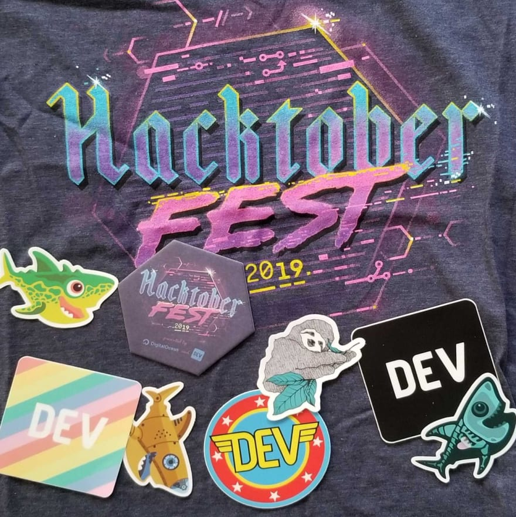
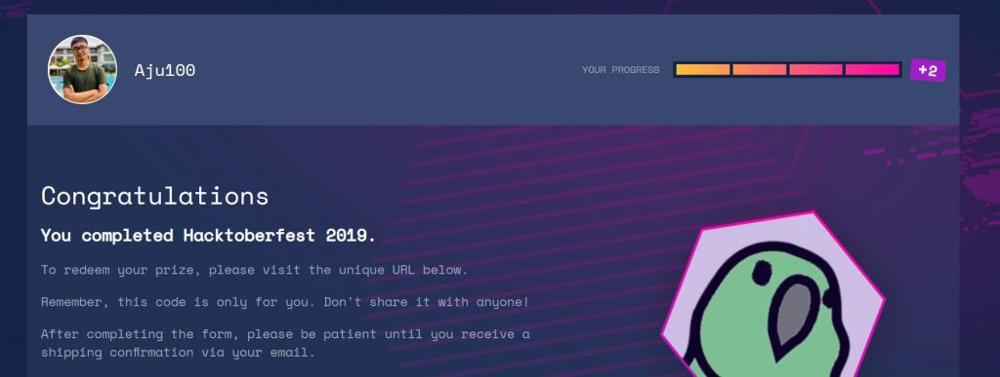
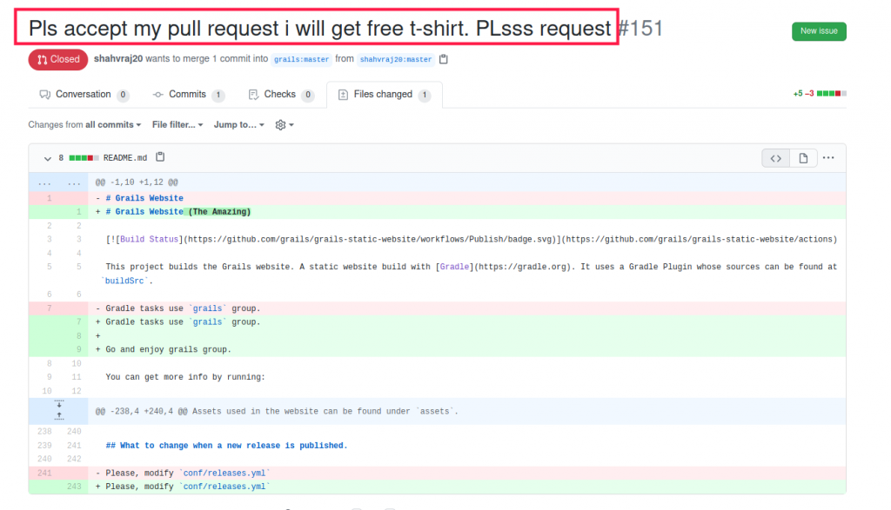
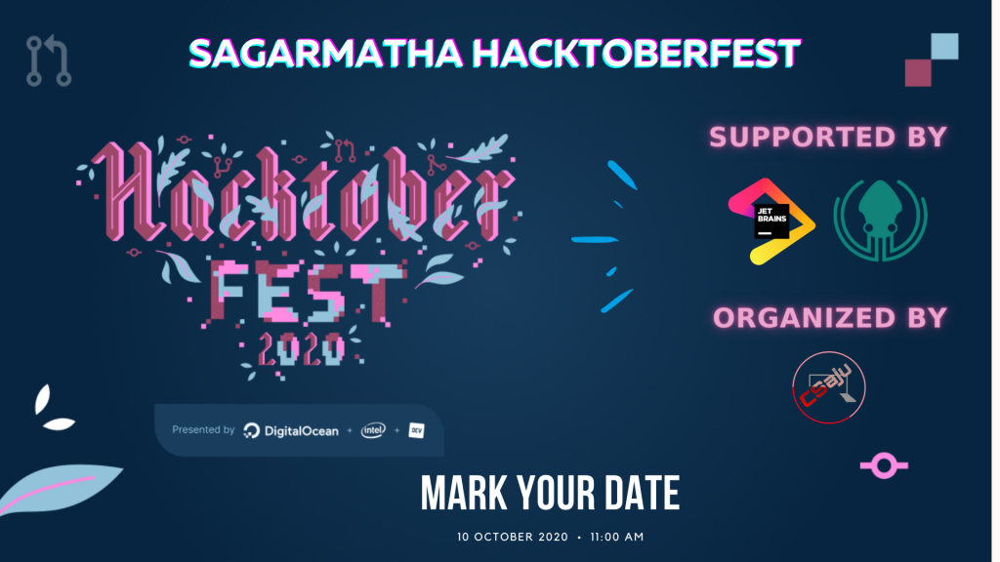

First, Let’s know about what is Hacktoberfest.
If you are a developer or student, you probably must have heard about hacktoberfest till now from your network or social media posts tagging as #hacktoberfest. Let’s make Hacktober a milestone month for the opensource projects.

Every year Digital Ocean partner up with Github and create a Hacktoberfest challenge during the month of October (Known as Hacktober) and ship out free Hacktoberfest shirts to thousands of people around the world. It’s a month-long event in October and tech enthusiasts all around the world are encouraged to contribute to the open-source repositories and help owners or organizations to fix some bugs and create new features.

I will definitely participate and you should too. It always feels like Hacktoberfest as a developers occasion to spread excitement for the Open-source. As I told, at the end of the month, You will get a cool free shirt and swags. And the cool thing is that you love swag, it’s pretty effective to achieve through contributing to opensource projects.

Yes, this year they offer an environmentally friendly choice: you can choose the picked tree option to replace the T-shirt with a planted tree in celebration of your accomplishments. The challenge is always about opensource trying to encourage people to participate more in open source projects.

On the Hacktoberfest site, they list projects you can participate in, focusing on projects in Javascript, Bash, C++, Python, Ruby, etc., with project owners tagging issues on their project with #Hacktoberfest so that people participating in the challenge can find things to contribute to.

I have been contributing to open-source mini-projects via GitHub since 2019. This was my profile after I accomplished the Hackotberfest 2019 challenge and you can also do as I will share on the way.

There are some certain criteria on this challenge that you have to follow.

You can signup anytime between October 1 to 31.
Pull requests reported by maintainers as spam or that are automated will be marked as invalid and won’t count towards the shirt.
Four quality Pull requests must be accepted to public GitHub repositories.
The true reality of Hacktoberfest is becoming a shitoberfest. Not a joke but it’s reality.

Contributing to some beginner-friendly projects is okay but what about Big open-source projects and organizations. People are spamming through Pull Requests like this.

Lol, the main intention of Hacktoberfest was not to get a T-shirt and swags, it’s about getting started with an opensource environment and giving back to the community. Please, it’s better to create high-quality one PR rather than those shits PR.

Many people have reached out and asked for some help in finding repositories to contribute to as a beginner. Here’s a list I’ve put together of projects you can contribute to today! If you’ve never contributed to an open-source project before, you don’t have to miss out on all the fun—check out our contributing to open source guide.

- Your First PR
- Hacktoberfest_CTF
- Hacktoberfest_Frontend
- Hacktoberfest_Backend
- Algorithms
- Hacktoberfest_Datascience

We are also organizing Hacktoberfest 2020 virtually.

The sad reality is that swags and t-shirt will arrive late in Nepal and we have to wait a few months. I was with my colleague Mahesh in the post office to grab our swags and it was really time-consuming as it shifts late. It’s not a problem if you are from other countries.

In past years T-shirts have been arrived in November or December, depending on the locations. The digital ocean team should eventually contact you asking for your shirt size and shipping address. There are tons of projects available on GitHub for hacktoberfest don’t miss this opportunity, start contributing to opensource and get a limited edition T-shirt for free! also stickers.

Here is the Event link that we are organizing and it might helped to along the way on Hacktoberfest Challenge.

If you wanted to learn Git and GitHub, you can read my previous article. As Git plays important role in your day to day software developer life and your hacktoberfest too.

You can find more from their official site.

You will also get valuable feedback to your pull request from the opensource developer which can progress your skills and give you a bigger picture, what to focus on a topic, where to learn that, how to follow best practices, and how you can avoid similar mistakes.

Happy Coding ❤
