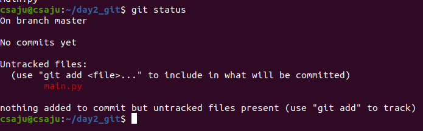
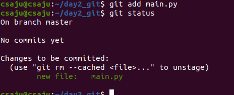
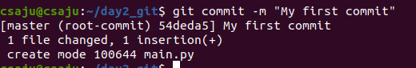
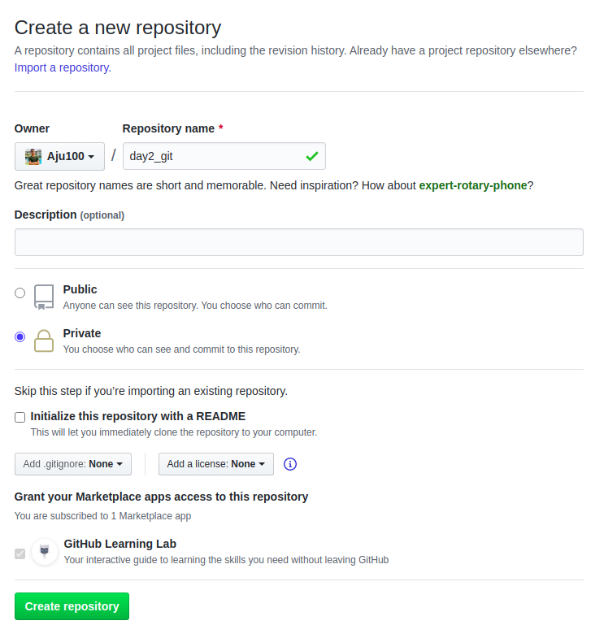
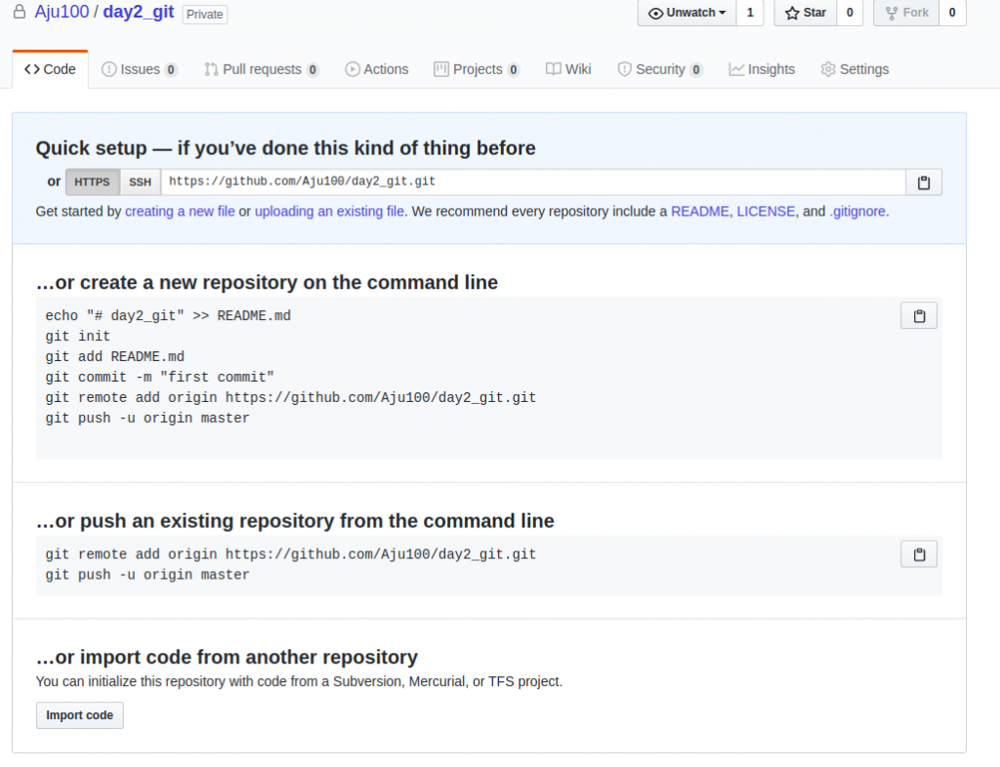
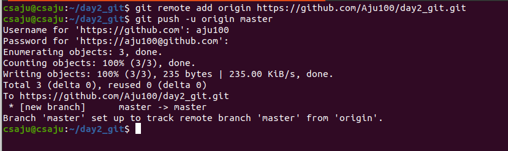
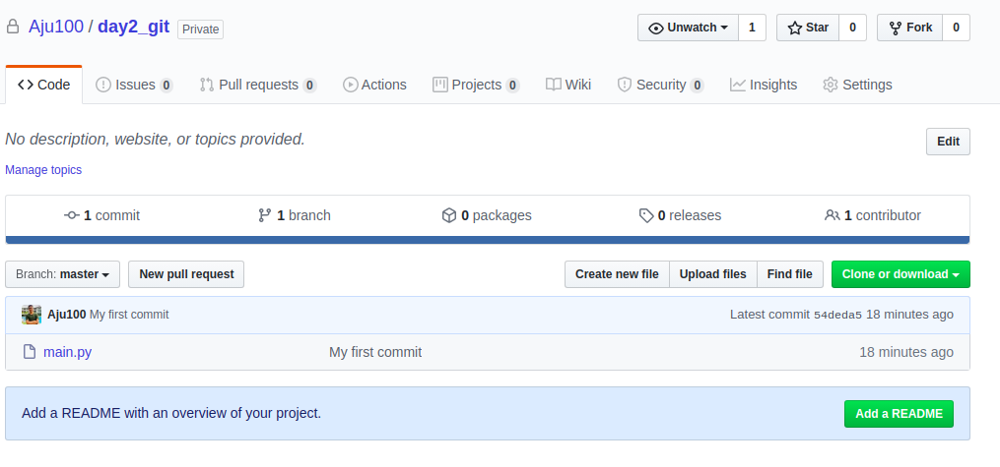
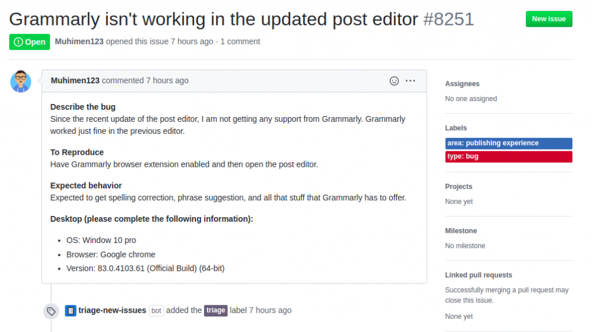
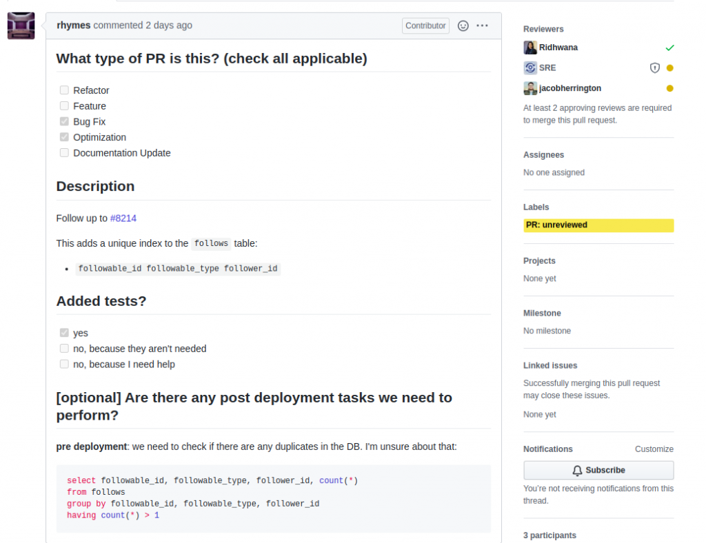

Hmm, Git, one of the most tools for software engineers. Before explaining about Git, Let’s know what is the version control system.

#### Version Control System

A system that records your file changes so that you can recall specific versions later. Let’s say you are right now at top renown company and you are writing code but you forget to add one feature which you missed or you wanted a beta version of your code. Now, what you will do? Will you able to have your beta version of your code? What’s the solution? You might get a solution by getting a backup of your previous code. But wait is that the better approach. No, it’s not. It’s time-consuming.

In this case, a version control system can recall your previous beta code and go further in your project. You can revert the entire project to a previous beta state too.

May be another new blog articles, I will be sharing about types of a version control system, we didn’t learn today about it but glad to know after learning myself about it. Git is one the version control system which can able to solve the problems of a software engineer and other tech professionals. There are other alternatives to Git too.

- Mercurial
- SVN or Subversion
- Bazaar
- Monotone
- CVS
- Other

We knew about the version control system. Git is one of them that helps you to manage projects. Let’s get into practice. First of all download the git on your system.

```bash
sudo apt-get install git
```

After you installed on your machine, check the version of git.

```bash
git ---version
```

After that, let’s follow the below commands.

```bash
mkdir day2_git
cd day2_git
git init
```

Here, we used mkdir to create a new directory called day2_git and cd to change the directory. We initialized the git repository by git init in our project. If you feeling unknown about few commands, don’t worry we will discuss later that''.

```bash
touch main.py
```

we created a file called main.py using touch and edited file. One more thing for you, git might feel difficult at first but once you learn it, you never want to go back to anything less flexible and powerful.

Ooho I forget to mention to configure the git on your machine. Let’s configure git. Before configuring git, I prefer you to create an account in GitHub too. It is easy to create an account in GitHub. Use your name which you had used in GitHub account and email too.

```bash
git config --global user.name "John Doe"
git config --global user.email "johndoe@mail.com"
```

You can set up ssh on your computer too. Let’s not get into ssh and go through as quickly as possible to quickly push your code in GitHub. Edit the main.py

Let’s check the status of main.py



git status commands help you check the status of the git repository. Oh no, our file hasn’t been tracked let’s track by simply using git add command.



We tracked the file and checked again too. Now, it’s time to reference the tracked file by using git commit.



wow, you did it. You knew a few basic git commands. Let’s learn what is GitHub and push your code into it.

#### what is Github ?

GitHub is a git repository hosting service and it’s the platform where you can host your local repository into the cloud. It has an awesome UI and provides many features. Lots of companies use GitHub for their organizational purpose. You have to know that GitHub is not the only Git hosting platform, there are others too like Git lab, Bit bucket, and many more. You had already created an account as I mentioned earlier.

Let’s create their repository and push our local repository to cloud one.


You created your first repository in GitHub. Awesome.



Here, it says to create a new repository on the command line. But we had already done it. So we will push our existing repository. We will follow below command using git remote add origin https:// and push to our default branch called master.




And you finally push to your file in GitHub. You can also create an issue when you have problems with that particular repository.

I have a reference example of an issue from the dev.to opensource project. Here it is.

If you wanted to contribute to the existing opensource project. You can send out Pull Request. It’s the best part of GitHub which enables friction less collaboration among millions of developers. .Pull Requests let you tell the opensource project maintainer about the changes you made and wanted to push to their repository. Here is the sample of creating a pull request.


We learned basic stuff on Git and GitHub. It’s getting better and better as being a software engineer trainee. I didn’t share about lots of GitHub features which I will share in upcoming articles. Thank you.
