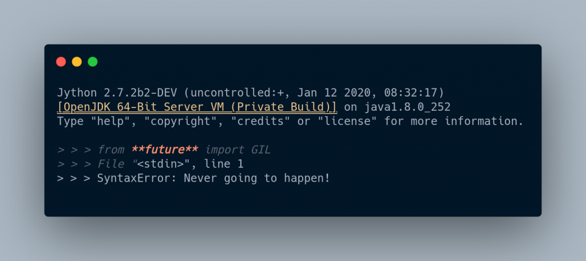

one of the misconceptions that developers say that python is too slow and python multithreading sucks. Well, it’s not true. let’s broaden this topic.
A lot of pythonists used to say GIL (Global Interpreter Lock) is the cause of the performance of python. They say it prevents u from running more than one thread at a time. You can’t get the real concurrency feature in python. Yes, it’s true but the truth is multithreading is still perfect. yeah, there are some exceptions which u have to lookout. And depending on the cases, it might need GIL otherwise why to make ur development life harder and being burn out. what Gil restricts that two bytecode can’t run parallelly. Threading can allow concurrency and reduces time consumption, increase performance.
As I mention here about GIL a lot but what actually it is? Well, Gil is a feature of CPython which default python manages memory. but Jython and IronPython lack the GIL coz it’s an implementation detail of the underlying VM. I tired about it and here is the result.

lol, they don’t have. they handle dynamic memory differently and can safely run the python code in multiple threads at the same time. And I think Cpython can’t remove the GIL feature too. And what’s the solution in order to achieve Multithreading. well, Many python libraries bypass multithreading issue by using C/C++ extensions.i recommend multiprocessing to get the benefits of all the cores. one more thing GIL is only a problem in a multiprocessor environment.

Conclusion
we can’t conclude that Multithreading can’t be achieved, you can still perform multithreading in Jython, IronPython even ur default one too. And GIL is a relevant topic, we will discuss more it and memory management behind the Python interpreter. On the upcoming topic, I will be sharing about the implementation of multithreading and concurrency in Python. Subscribe to our newsletter, I will be updating new contents monthly. Thank you.
