It all begins when one of my fellows recommends me TryHackMe for learning a variety of infosec fields for being a better developer before going to HackTheBox. Yes, these platforms are really awesome and worth to try. Recently TryHackMe releases ten days OWASP Top 10 challenges where you can learn OWASP Top 10 practically. You will learn many things within a short span of time which I had learned so far. Most of the developers don’t focus on security stuff and ignore a lot of things during development purposes. I get to know about CTF and how it will help both cybersecurity enthusiasts and developers. This article is mentioned above in the title too about OWASP Top 10.

> This article is focused on beginner people who are getting started in their infosec field or wanted to expand their skills by developers

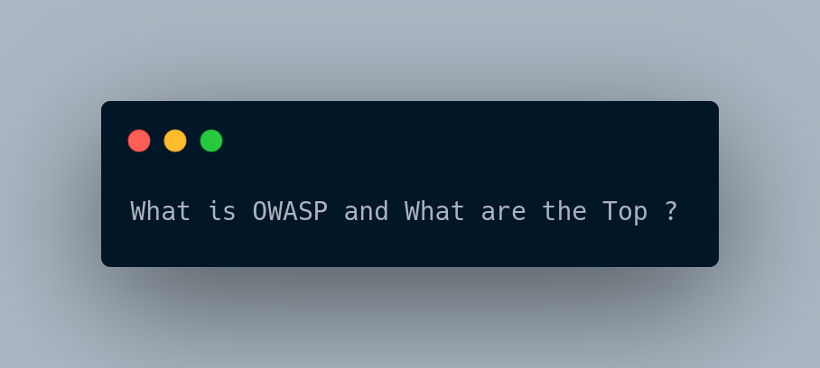

Open Web Application Security Project (OWASP) is a nonprofit organization that produces articles, methodologies, tools, and technologies in the field of web application security and others too. OWASP releases a document called OWASP Top 10 that consists of critical security risks to web applications. OWASP document would help any people not only exploiting them but also how to protect them from those vulnerabilities. In order to kick start OWASP Top 10 challenges you don’t require prerequisite knowledge related to those vulnerabilities and tools, you can easily catch up during challenges.

First of all, you have to connect to the TryHackMe network using OpenVPN. Here is the complete reference on how to configure and connect. After you connect to the TryHackMe network you can enter OWASP Top 10 room and start to learn.

#### Let's get started

Challenge link : https://tryhackme.com/room/owasptop10

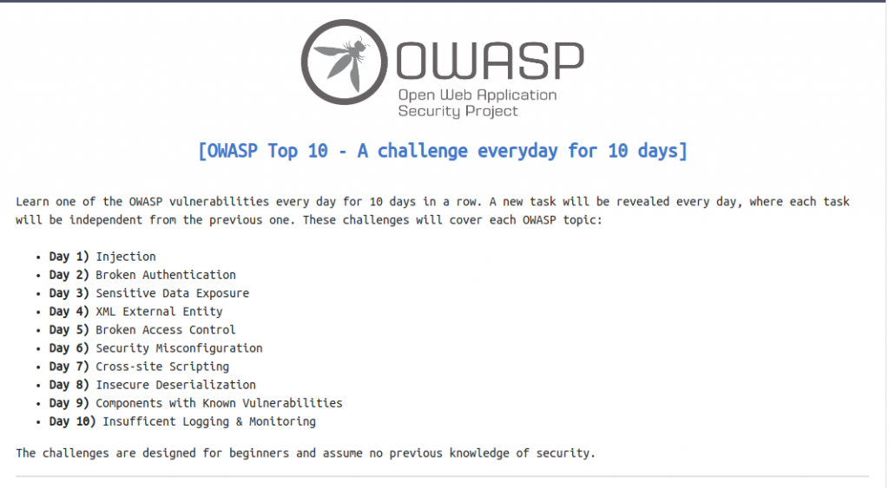

#### Injection 💉💉💉

We will be talking about only about Command Injection. I will write a blog about SQL injection later on. Command Injection basically occurs when user input is passed to system commands. Let’s say you visited a random vulnerable e-commerce web site and it has a search section where people search the product name. But you execute their system commands, and server response and perform executions.

As a result, an attacker is able to perform system commands and it can be a great loss to the company if an attacker performs malicious stuff. They can perform CRUD (Create, Read, Update, Delete) operations on the application server. This means they can do anything like they delete, modify, steal sensitive information of customers too. First of all, deploy the machine and browse to the URL: Http://<machine_ip>/evilshell.php which would look something like this:

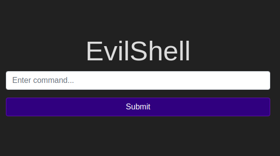
Try out some Linux commands , server will response and execute those commands.

What strange text file is in the website root directory?

I used ls, it shows many files in the current directory, you find it “drepper.txt” and submit it.

How many non-root/non-service/non-daemon users are there?

As I was familiar with the Linux machine, I know that where username from the passwd file store which is located in the /etc/passwd directory. So I used cat command to view passwd file as “cat /etc/passwd”.

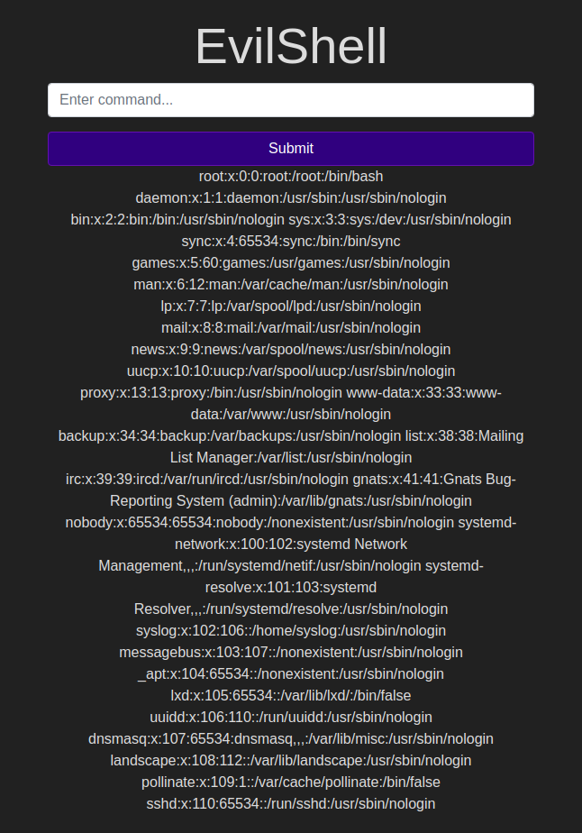

There are no non-root/non-service/non-daemon users from the output. The answer is 0.

What user is this app running as?

You can use the whoami command to check which user is running this application.

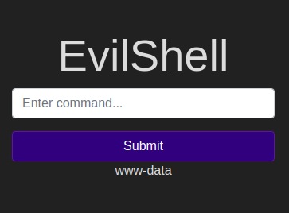

What is the user’s shell set as?

As we retrieved the passwd file which contains all the user’s information. We can retrieve which permission is allowed to that user. Answer is /usr/sbin/nologin .

What version of Ubuntu is running?

You can check out using lsb_release -a . Answer is 18.0.4.4

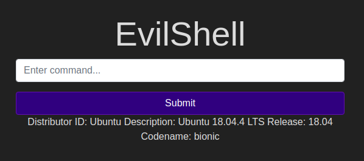

Print out the MOTD. What favorite beverage is shown?

Wait what is MOTD? I wasn’t aware of it and I took reference through the internet and it’s “Message of the Day”. The hint was given too “00-header”. This file was located in /etc/ directory and I quickly locate the file and view the file using cat /etc/update-motd.d/00-header.

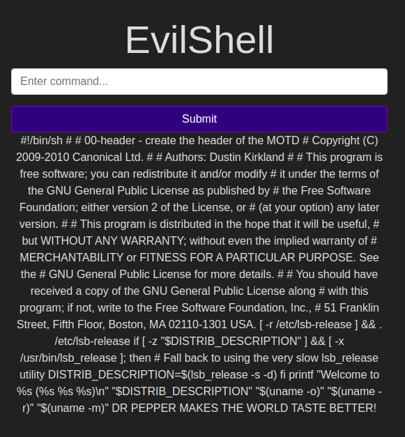

according to the question , they asked for a beverage and I got the name i.e DR PEPPER.

#### Broken Authentication 💔

Authentication has become the core component of modern web applications. It allows users to gain access by verifying their identities mostly done using username and password. If an attacker found vulnerability, they can easily get access to other user accounts. Some common flaws include Brute force attacks, use of weak credentials, weak sessions cookies. Developers can also prevent such flaws too by avoiding brute force and password guess attacks, implementation of Multi factor authentication too.

Go to your IP machine with port 8888. <ip_machine>:8888

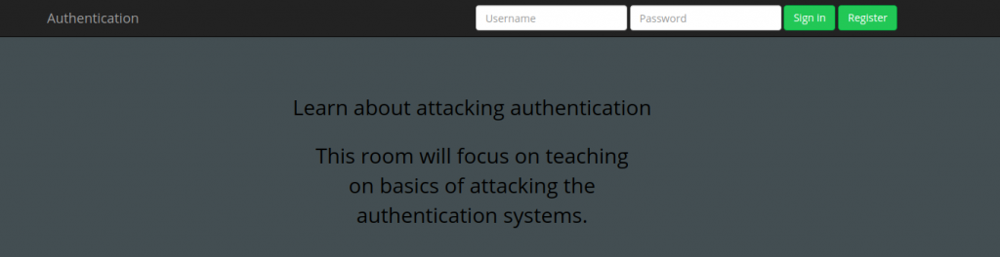

From the above instructions, it told me about to register a user name called darren. Here, we will create an account of the same user but append the symbol ” “ as ” darren“.

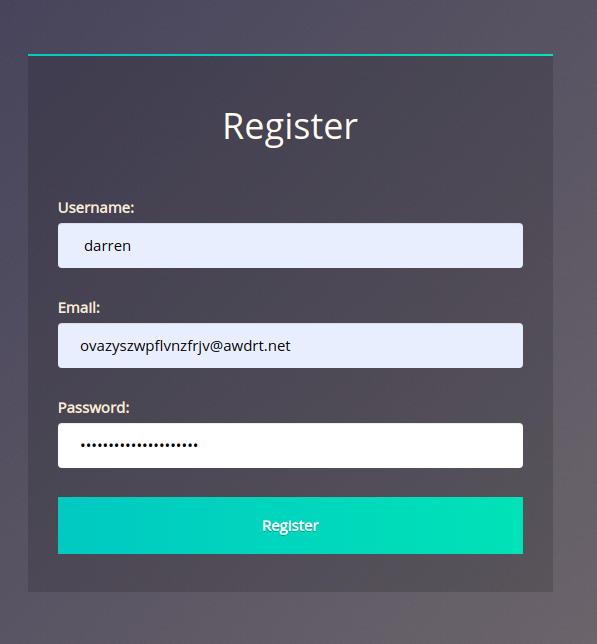

You created an account and try out login. It will be and you are able to get the dareen account. You get the flag in darren account and submit it as it asked.

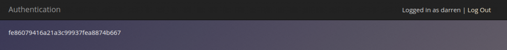

#### Sensitive Data Exposure 💾

It’s a leakage of some personal or confidential information from a web app. This can range from basic user info to more confidential details like bank credentials and others.

What is the name of the mentioned directory?

we need to find a directory where sensitive data has been leaked. There is also a hint . Let’s check the source code using developer tools. You got an answer as “/assets”.

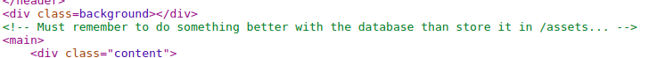

Navigate to the directory you found in question one. What file stands out as being likely to contain sensitive data?

Let’s get into assets

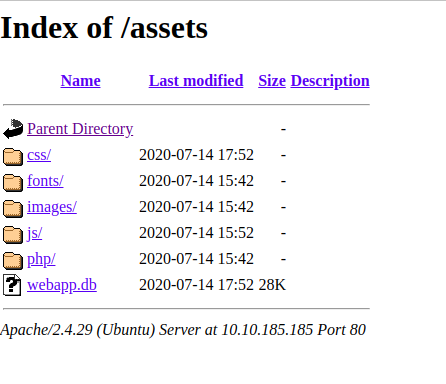

You see there database file which has extension as db . Answer is webapp.db.

Let’s dig more into the database file. I recommend you have a SQLite lightweight database. I opened the file and look up the tables.
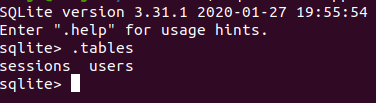

We have tables, “sessions” and “users”. Let’s get the info about database table “users”.

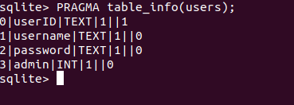

From the above results, we see that the third column would be containing the password hashes which we need. use SELECT \* FROM users;

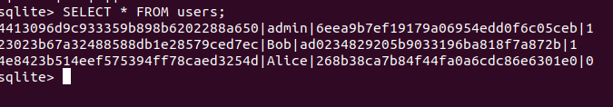

here is the admin password hash which is the answer.

What is the admin’s plain text password?

Let’s crack the hash password. You can use an online site for it. I used crackstation.

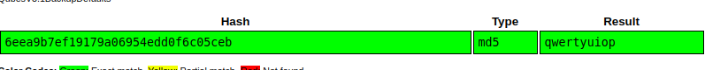

You get the password and answer too. Let’s login using a username and password. You get the flag too.

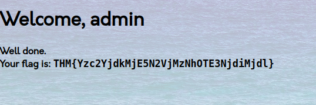

#### XML External Entity

For this challenge, you have to learn XML too. XML External Entity attack is a vulnerability that abuses features of an XML parser. It often allows attackers to read the file on that system. It could cause SSRF and DOS too. It may even enable to scan port and lead to remote code execution. Some challenge is easy which wrap up the fundamentals of XML too.

Full form of XML

It was easy though Extensible Markup Language.

Is it compulsory to have XML prolog in XML documents?

No

Can we validate XML documents against a schema?

Yes

How can we specify XML version and encoding in XML document?

XML prolog

How do you define a new ELEMENT?

!ELEMENT

How do you define a ROOT element?

!DOCTYPE

How do you define a new ENTITY?

!ENTITY

Now we comes into exploitation part.

What is the name of the user in /etc/passwd ?

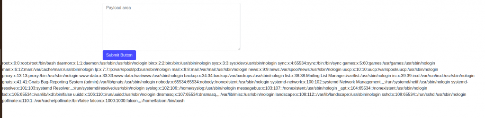
there you got the user “falcon”. Let’s find ssh key too. as we know where ssh key locates in Linux machine “home/username/.ssh/id_rsa” and you know the username. You get the location of the ssh key. Now let’s get the ssh key. Use this payload.

```xml
<?xml version="1.0"?>
<!DOCTYPE root [<!ENTITY read SYSTEM 'file://home/falcon/.ssh/id_rsa'>]>
<root>&read;</root>
```

You got the ssh key .

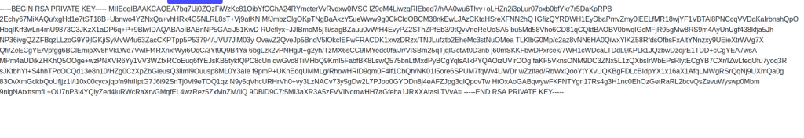

#### Broken Access Control 🚫

Sometimes access control failures can lead to unauthorized information disclosure, modification or anything stuff. This is what we called as broken access control. It can be anything like metadata manipulation, bypassing access control checks by modifying the URL or simply building API attack tool. You can prevent too like using access control lists and role based authentication mechanisms.

First of all, login with username and password as mentioned in the instructions. This results out when you successfully login.

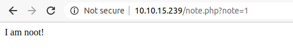

You see parameter and try to change the number out there from number 1 to any number. You might see something else too. You get a flag when you enter 0. That’s the answer.

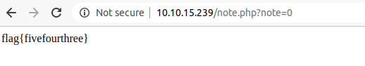

Today it’s been five days of OWASP TOP 10 challenges too. I will write the rest of the challenges at the end of Day 10. Thank you. Keep sharing my articles with the authentic audiences with whom it can help them too in order to understand some basic vulnerabilities.
