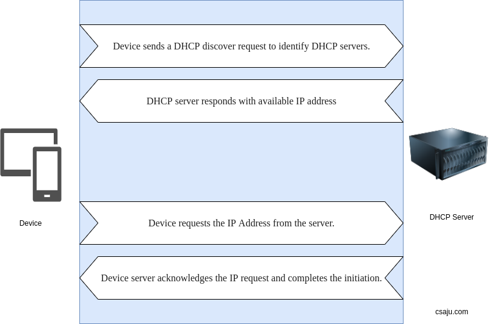

Without it, the network administrator has to manually set up every client that joins the network which is difficult to manage when scaling the large networks.

Let me share my DHCP story, I still remembered those days about how to hack the WiFi network after watching some Indian tutorials. Trust me a lot of people had been gone through this, I had followed their commands as mentioned in tutorials and typed in the terminal some commands like ifconfig, nslookup, and used some scripts. I had typed in my terminal about ifconfig, I didn’t know about what it does and how these commands are made and executed. Just pretending to be Pro Hacker after learning those commands during those days but in reality, I wasn’t.

Lol, I was stupid and later realized what needs to take to be Cybersecurity professionals. You may get a bunch of results after heating those commands like about the IP address of your local network and DHCP too. And that’s how DHCP comes into my mind and learned about it and other protocols.

Let’s come into the section, DHCP servers assign each client with a unique dynamic IP address and can stretch IP addresses by limiting how long a device can keep an individual IP address.

> Note: Client is not a customer 😂 like in business.

#### Why DHCP ?

I had explained above about its core functionalities. As I said, the DHCP protocol gives the network administrator a method to easily configure the network.

#### How DHCP work ?

First of all let’s have a end to end connection with DHCP server and device. You will clear out much more through visual. I had tried my best although I am not good at Photoshop and editing tools.

I hope you got concepts about how DHCP works.

#### Let’s look some weakness of DHCP.

- DHCP is not inherently secure and non- routable protocol.
- DHCP is vulnerable to Man in the middle attacks where an attacker can intercept messages between two parties as well as memory consumption issues.
- Unless the DHCP server has a backup system, all the devices connected to the DHCP server would be affected when the DHCP server fails.
- DHCP is not suitable for permanent purposes for needing constant access like printers.
- DHCP lacks any built-in mechanism that would enable clients and servers to authenticate each other.

Let’s learn what kind of information is provided by the DHCP server to the clients. The DHCP port number for the server is 67 and 68 for the client. The DHCP server provides basic four information to the DHCP clients but there are 8 DHCP messages in the process.

- The IP address for the clients(Computer, Desktop, Smartphone, Laptop)
- Subnet mask information
- Default Gateway IP address
- The IP address of the Domain Name Server

It already became five things about DHCP. Awesome. Note: I didn’t share deeply about the DHCP message. I will share about that in the upcoming post. Wanna know more about DHCP. Visit this site. And have you read about OWASP Top 10 vulnerabilities? If you haven’t, why don’t you wanna read? Here is the link.
